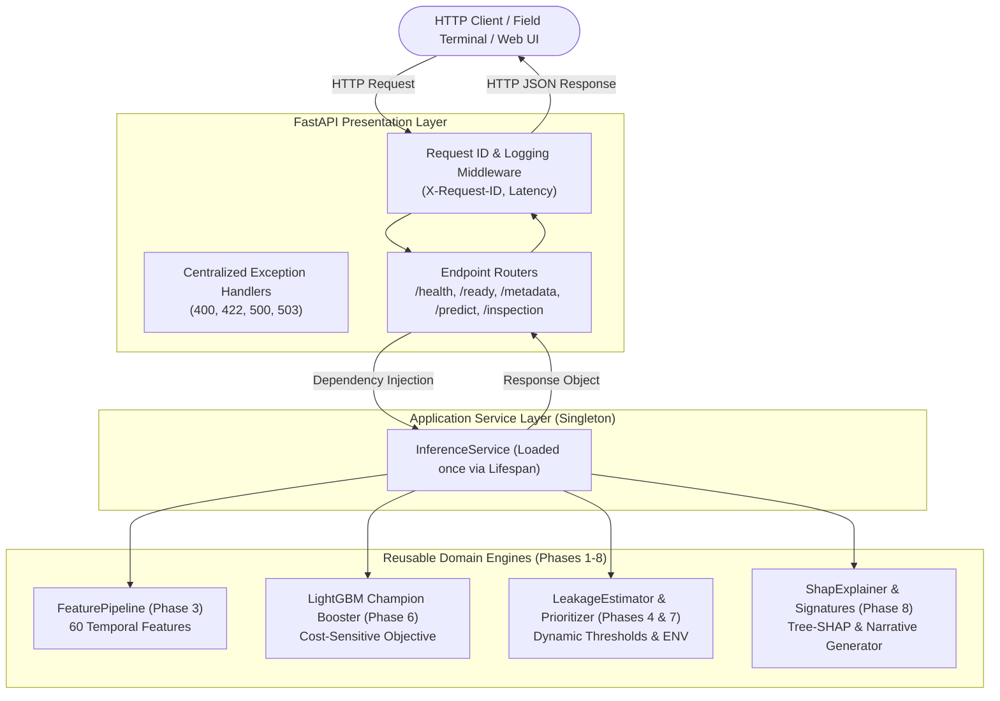
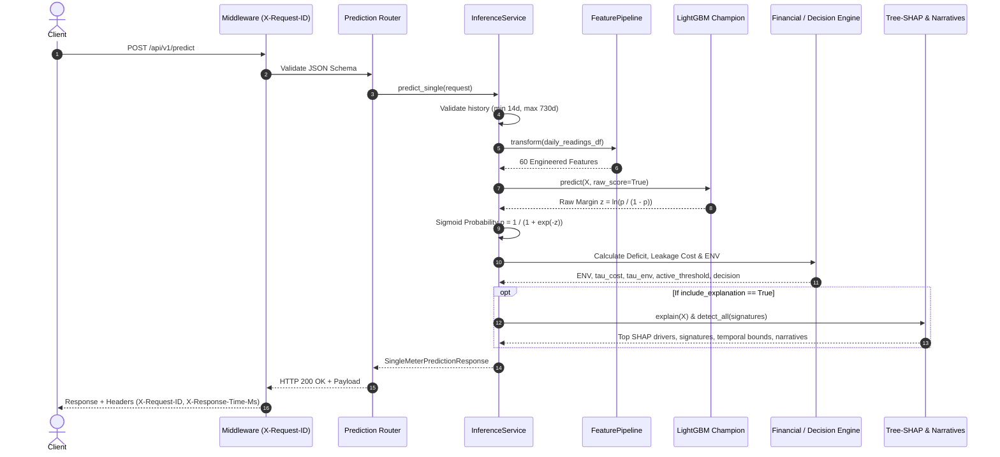

# Grid-Guard — API Architecture & System Design

This document details the architectural design, lifecycle, dependency injection patterns, and request flows of the Grid-Guard FastAPI inference service.

---

## 1. System Architecture Overview

The Grid-Guard API is designed as a stateless, high-throughput microservice exposing the complete intelligence pipeline built across Phases 1–8. It adheres strictly to the principle of separation of concerns: routes contain zero algorithmic business logic, delegating completely to the domain and service layers.

---

## 2. Application Lifecycle & In-Memory Model Pinning

ML model and explainer reloads are strictly prohibited during normal request handling. Loading large gradient-boosted decision tree structures and constructing TreeExplainer graphs incurs hundreds of milliseconds of initialization overhead.

### Lifespan Protocol
During the application startup phase (`@asynccontextmanager async def lifespan(app: FastAPI)`):
1. **Artifact Verification**: Verifies the existence of `artifacts/cost_sensitive/champion_model.txt`.
2. **Booster Initialization**: Loads the 60-feature LightGBM booster into RAM once.
3. **Explainer Construction**: Pre-computes the TreeExplainer graph and extracts the base expected margin value $\mathbb{E}[z] = -2.5928$.
4. **Domain Engine Attachment**: Binds `FeaturePipeline`, `LeakageEstimator`, `TamperingSignatureDetector`, and `TemporalAttributor`.
5. **Readiness Exposure**: Stores the `InferenceService` instance on `app.state.inference_service`.

If artifact loading fails, the service enters an explicit `unready` state and returns `HTTP 503 Service Unavailable` on prediction and readiness routes, preventing silent degradation.

---

## 3. Request Flow & Execution Pipeline

---

## 4. Error Handling & Security Model

1. **Uniform Error Schema**: All errors return a standardized `ErrorResponse` containing `error_type`, `message`, `details`, and `request_id`.
2. **Correlation Tracing**: Every inbound request receives an `X-Request-ID` (either client-supplied or generated via `req-{uuid[:12]}`) propagated through response headers and structured logs.
3. **Data Privacy**: Telemetry consumption arrays, tariffs, and account balances are strictly excluded from operational logs. Logs only record metadata (method, route, status code, latency, request ID).
4. **Input Sanitization**:
   - Pydantic models reject negative consumption values ($< 0.0$ kWh).
   - `NaN` and `$\pm\infty$` values trigger explicit 422 Unprocessable Content.
   - Timestamp duplicates are caught and rejected.
   - Bounded batch sizes (max 50) prevent resource starvation.

---

## 5. Performance Benchmarks Summary

Measured on local test environment with 90-day daily meter histories:

| Endpoint / Operation | Latency | Target |
| :--- | :---: | :---: |
| **Cold Startup Time** | **0.265 s** | < 2.0 s |
| **Prediction (Bare Inference)** | **21.87 ms** | < 50.0 ms |
| **Prediction (Full Tree-SHAP + Narratives)** | **29.14 ms** | < 80.0 ms |
| **Batch Prediction (10 meters)** | **250.12 ms** (25.0 ms/meter) | < 500.0 ms |
| **Inspection Ticket Generation** | **34.25 ms** | < 100.0 ms |
| **Inspection Queue Ranking Query** | **14.75 ms** | < 50.0 ms |
