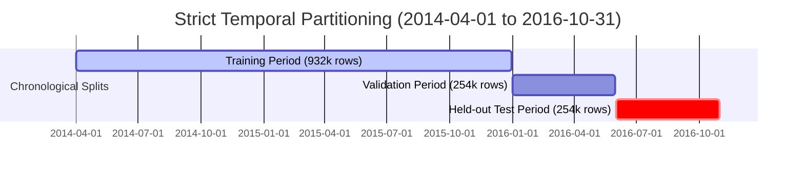

# Grid-Guard Baseline Model & Time-Aware Benchmark

## 1. Overview

The primary goal of Phase 4 is to establish an unweighted, strictly time-aware baseline model against which later cost-sensitive and class-imbalance methods will be benchmarked.

In accordance with Phase 4 boundary requirements:
- The baseline model is an **ordinary unweighted LightGBM binary classifier**.
- It deliberately does **NOT** use SMOTE, random oversampling, class weighting, `scale_pos_weight`, custom cost-sensitive loss functions, or dynamic decision thresholds.
- Predictions are evaluated at the conventional **0.5 classification threshold**.

---

## 2. Temporal Splitting Protocol

Smart-meter time-series data contains repeated observations per meter over time. Random k-fold cross-validation or uniform train/test splitting violates temporal integrity and leaks future consumption patterns and seasonal trends into the training set.

Grid-Guard enforces a **strictly non-overlapping chronological split**:



### Partition Boundaries

| Partition | Start Date | End Date | Span | Row Count | Meter Count | Theft Prevalence |
|---|---|---|---|---|---|---|
| **Train** | `2014-04-01` | `2015-12-31` | 21 months | 932,184 | 42,372 | 8.53% |
| **Validation** | `2016-01-01` | `2016-05-31` | 5 months | 254,232 | 42,372 | 8.53% |
| **Held-out Test** | `2016-06-01` | `2016-10-31` | 5 months | 254,232 | 42,372 | 8.53% |

> [!NOTE]
> The dataset covers `2014-01-01` to `2016-10-31`. The initial 90-day window (`2014-01-01` to `2014-03-31`) is reserved as the feature engineering warm-up window so that 90-day rolling statistics (`rolling_mean_90d`, `rolling_std_90d`) are fully populated before the training period starts.
> To prevent memory exhaustion while retaining full temporal dynamics across all 42,372 meters, a 30-day periodic snapshot stride is used, corresponding to operational monthly meter-reading inspection cycles.

---

## 3. Target and Feature Separation

### Unit of Prediction
The unit of prediction is `(meter_id, timestamp)` at periodic evaluation intervals using trailing historical windows $\le t$.

### Feature/Target Exclusions
The following fields are strictly excluded from the model feature matrix $X$:
- `tamper_label` / `FLAG`: Ground truth binary target (Theft = 1, Normal = 0).
- `meter_id`: Identifier preserved exclusively for grouping and ranking outputs.
- `timestamp`: Preserved exclusively for temporal splitting and timeline tracking.
- `data_quality_status`: Preprocessing metadata indicator.
- `leakage_daily_kwh`, `leakage_monthly_kwh`, `estimated_leakage_cost`: Post-event financial simulation metrics.

### Model Features
The baseline consumes the 60 engineered features produced by Phase 3, encompassing:
1. Multi-scale rolling statistics (`7d`, `14d`, `30d`, `60d`, `90d` mean, std, min, max, median, CV).
2. Trailing historical consumption lags (`1d`, `2d`, `3d`, `7d`, `14d`, `30d`).
3. Multi-window consumption drop ratios (`14d/60d`, `30d/60d`, `30d/90d`).
4. Tampering signatures (zero streaks, zero ratios, sudden drop severity, historical variance collapse).
5. Cyclical calendar features (day of week sine/cosine, month sine/cosine, weekend indicator).
6. Quality and imputation indicators (`coverage_ratio`, `imputation_ratio`, `missing_ratio`).

---

## 4. Baseline Model Hyperparameters

The model is an unweighted `LGBMClassifier` initialized with conservative parameters:
- `objective`: `"binary"`
- `metric`: `"binary_logloss"`
- `learning_rate`: `0.05`
- `n_estimators`: `200`
- `max_depth`: `6`
- `num_leaves`: `31`
- `subsample`: `0.8`
- `colsample_bytree`: `0.8`
- `random_state`: `42`
- `early_stopping`: 30 rounds monitored on validation partition.

---

## 5. Empirical Performance on Real Held-Out Test Set

The baseline was trained on 932,184 training samples and evaluated on 254,232 held-out test observations.

### A. Statistical Classification Metrics (Threshold = 0.5)

| Metric | Measured Baseline Value | Interpretation |
|---|---|---|
| **Total Test Samples** | `254,232` | 42,372 meters over 5 test months |
| **Actual Thefts ($P$)** | `21,690` | Ground truth positive class |
| **Actual Normal ($N$)** | `232,542` | Ground truth negative class |
| **Class Prevalence** | `8.53%` | Moderate class imbalance |
| **True Positives ($TP$)** | `3,161` | Correctly identified theft cases |
| **False Positives ($FP$)** | `3,580` | False alarm dispatches |
| **True Negatives ($TN$)** | `228,962` | Correctly unflagged honest meters |
| **False Negatives ($FN$)** | `18,529` | Undetected theft cases |
| **Precision** | **`46.89%`** | Almost 1 in 2 inspections finds theft |
| **Recall** | **`14.57%`** | **Severe failure of unweighted baseline: 85.4% of thefts are missed** |
| **F1-Score** | `0.2224` | Harmonic mean of precision and recall |
| **PR-AUC** | **`0.2959`** | Primary metric under imbalance (vs. 0.0853 random chance baseline) |
| **ROC-AUC** | `0.7711` | Discriminative ranking capability |
| **Positive Prediction Rate** | `2.65%` | Model predicts positive on only 2.65% of fleet |

### B. Operational Ranking Metrics (Precision@K)

In real utility operations, field crews have fixed monthly inspection capacities ($K$). The model ranks meters by predicted theft probability:

| Capacity ($K$) | True Positives Detected | False Positives | Precision@K | Theft Capture Rate (Recall@K) |
|---|---|---|---|---|
| **Top 10** | 8 | 2 | **`80.00%`** | 0.04% |
| **Top 50** | 42 | 8 | **`84.00%`** | 0.19% |
| **Top 100** | 82 | 18 | **`82.00%`** | 0.38% |
| **Top 500** | 316 | 184 | **`63.20%`** | 1.46% |
| **Top 1,000** | 570 | 430 | **`57.00%`** | 2.63% |
| **Top 2,000** | 1,029 | 971 | **`51.45%`** | 4.74% |

> [!TIP]
> In high-priority inspection scenarios (Top 10 to Top 100), the baseline achieves $> 80\%$ precision. However, when inspecting larger fleets (Top 1,000+), precision rapidly decays toward 50%.

---

## 6. Top Features by Gain Importance

Ranked feature importance extracted from the trained LightGBM model:

| Rank | Feature | Importance (Gain) | Category |
|---|---|---|---|
| 1 | `coverage_ratio` | 315,689.7 | Data Quality / Missingness |
| 2 | `imputation_ratio` | 200,468.8 | Data Quality / Missingness |
| 3 | `missing_ratio` | 189,305.3 | Data Quality / Missingness |
| 4 | `rolling_std_90d` | 60,366.9 | Long-term Volatility |
| 5 | `rolling_std_30d` | 35,780.0 | Medium-term Volatility |
| 6 | `rolling_std_60d` | 26,386.2 | Intermediate Volatility |
| 7 | `rolling_max_30d` | 26,056.3 | Peak Consumption |
| 8 | `rolling_min_30d` | 18,099.9 | Minimum Baseline |
| 9 | `rolling_median_30d` | 12,221.2 | Typical Baseline |
| 10 | `rolling_min_7d` | 8,866.5 | Short-term Floor |
| 11 | `consumption_kwh_lag_14d` | 6,610.8 | Biweekly Lag |
| 12 | `weekly_autocorr_30d` | 6,348.4 | Weekly Periodicity |
| 13 | `rolling_mean_90d` | 5,130.6 | Long-term Mean |
| 14 | `ratio_30d_90d` | 4,792.0 | Consumption Step-Down Ratio |
| 15 | `zero_count_30d` | 4,485.7 | Zero-Consumption Streak |

---

## 7. Artifact Directory Structure

All Phase 4 baseline modeling artifacts are stored under `artifacts/baseline/`:

```
artifacts/baseline/
├── baseline_metrics.json              # Machine-readable evaluation metrics
├── baseline_predictions.parquet       # Per-meter probabilities, classes & ranks
├── financial_cost_report.md           # Audit trail and cost breakdown
├── feature_importance_gain.csv        # Full ranked gain feature importances
├── feature_importance_split.csv       # Full ranked split feature importances
├── figures/
│   ├── pr_curve.png                   # Precision-Recall curve with PR-AUC
│   ├── roc_curve.png                  # ROC curve with ROC-AUC
│   ├── confusion_matrix.png           # Raw counts and normalized heatmap
│   ├── probability_distribution.png   # Normal vs. tampered probability separation
│   ├── feature_importance.png         # Top 20 features by Gain
│   ├── financial_loss_breakdown.png   # Dispatch cost vs. leakage impact
│   └── precision_at_k.png             # Precision vs. inspection capacity
└── baseline_lightgbm.txt              # Trained model checkpoint (git-ignored)
```

---

## 8. Reproducibility & CLI Execution

To rerun the Phase 4 baseline pipeline end-to-end:

```bash
# Run baseline training, evaluation, artifact export, and MLflow tracking
uv run python scripts/run_baseline.py all

# Override dispatch cost or tariff
uv run python scripts/run_baseline.py all --dispatch-cost 120.0 --tariff 0.18

# View MLflow experiment dashboard
uv run mlflow ui --backend-store-uri sqlite:///mlruns/mlflow.db
```
