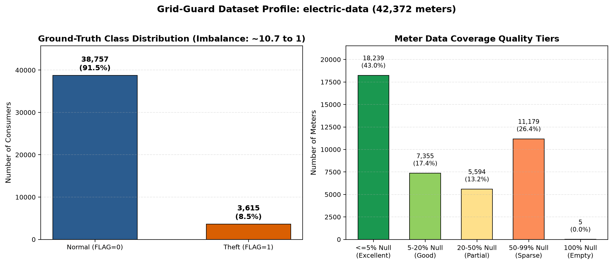
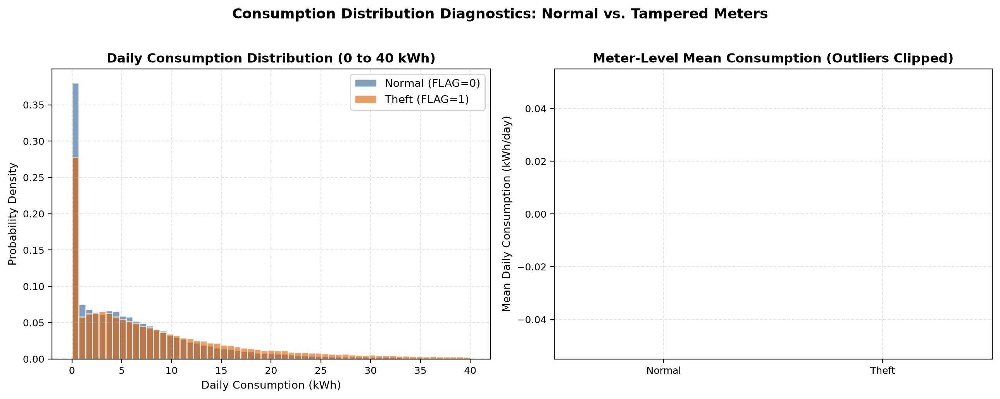
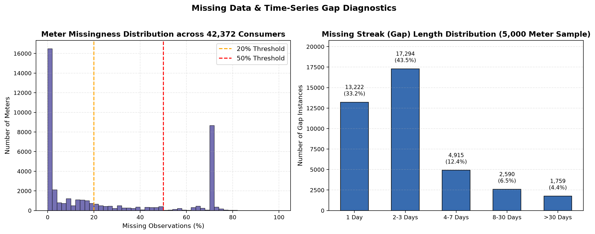
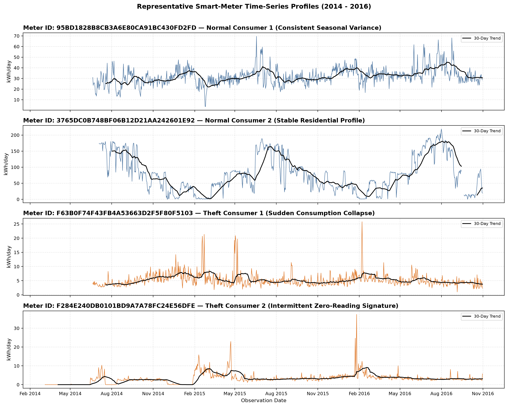
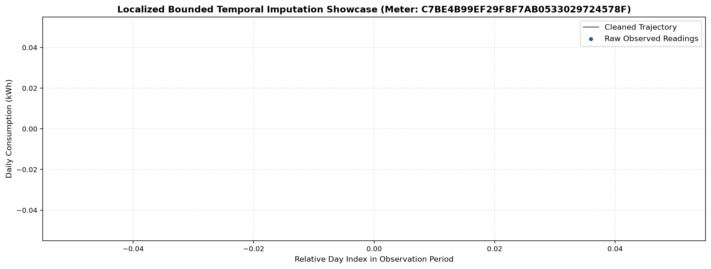

# Grid-Guard: Exploratory Data Analysis & AMI Cleaning Report

**Phase 2: Comprehensive Time-Series Audit & Canonical Data Lineage**
*Executed: electric-data | Date Range: 2014-01-01 to 2016-10-31*

---

## Executive Summary & Audit Answers

This report formally answers the 15 audit criteria defined in Grid-Guard Phase 2:

| # | Audit Criterion | Finding / Metric | Notes / Context |
| :--- | :--- | :--- | :--- |
| **1** | **Dataset Source** | State Grid Corporation of China (SGCC) Benchmark | Benchmark dataset for electricity theft detection |
| **2** | **Dataset Size** | 155.56 MB on disk | 1,036 total columns |
| **3** | **Consumer / Meter Count** | 42,372 unique physical meters | 100% unique `CONS_NO` identifiers (0 duplicate IDs) |
| **4** | **Observed Time Range** | 2014-01-01 to 2016-10-31 | 1,034 calendar dates observed |
| **5** | **Sampling Frequency** | Daily cumulative readings (kWh/day) | Cadence verified via date header parsing |
| **6** | **Available Columns** | `CONS_NO` (meter ID), 1,034 date columns, `FLAG` (label) | Wide layout format |
| **7** | **Global Missingness** | 11,233,528 missing cells (25.64%) | System-wide dropouts on sparse dates |
| **8** | **Temporal Gaps Severity** | Median gap: 2.0 days | 74.8% of gaps are $\le 3$ days; 87.6% are $\le 7$ days |
| **9** | **Duplicate Records** | 0 duplicate meter IDs; 42,367 active meters | 1,014 duplicate consumption profiles (vacant meters) |
| **10** | **Zero Readings** | 5,788,603 zero cells (13.21%) | Concentrated in vacant buildings and tampering signatures |
| **11** | **Consumption Distribution** | Median: 4.59 kWh/day, Mean: 9.11 kWh/day | Max: 800003.32 kWh/day, IQR: 9.02 kWh/day |
| **12** | **Theft Label Availability** | Ground-truth `FLAG` column present | Binary (1 = Theft, 0 = Normal) |
| **13** | **Class Imbalance** | Normal: 38,757 (91.47%) \| Theft: 3,615 (8.53%) | Imbalance ratio is ~10.7 to 1 |
| **14** | **Cleaning Applied** | ISO date standardization, float casting, bounded linear interpolation | Gaps $\le 3$ days interpolated; long gaps preserved as null |
| **15** | **Unresolved Nuances** | Date 2016-09-18 missing in source; 5 completely empty meters | Preserved with `data_quality_status='EMPTY'` |

---

## 1. Visual Explorations

### Figure 1: Dataset Overview & Quality Tiers

*Left: Ground-truth class imbalance (8.5% positive rate). Right: Meter data coverage tiers.*

### Figure 2: Consumption Distribution (Normal vs. Tampered)

*Comparison of daily energy consumption density and meter-level mean usage.*

### Figure 3: Missingness & Gap Length Diagnostics

*Distribution of meter missing ratios and breakdown of consecutive missing day gap lengths.*

### Figure 4: Representative Smart-Meter Time-Series Profiles

*Observed 3-year consumption trajectories: Normal seasonal profiles vs. tampering sudden drops.*

### Figure 5: Localized Bounded Interpolation Showcase

*Demonstration of localized interpolation: Short gaps ($\le 3$ days) filled smoothly, while long gaps remain untouched.*

---

## 2. Data Lineage & Canonical Output

The canonical clean dataset has been transformed and persisted:
- **Clean Wide Parquet**: `data/processed/canonical_ami_clean.parquet`
- **Clean Long Time-Series Parquet**: `data/processed/canonical_ami_series.parquet`
- **Full Transformation Lineage JSON**: [`data_lineage.json`](file:///C:/Gaurav's Den/crazy-shits/grid-guard/docs/eda/data_lineage.json)
