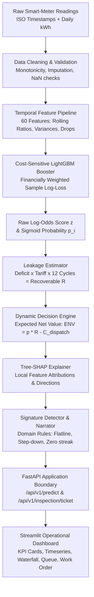

# Grid-Guard End-to-End Pipeline & Data Flow

This document maps the complete technical trace of data flow and operational logic through **Grid-Guard**, from raw AMI smart-meter time-series ingestion to actionable field inspection work order generation.

---

## 1. End-to-End Architecture Flowchart

---

## 2. Stage-by-Stage Operational Trace

### Stage 1: Ingestion & Input Contract
- **Input**: Daily smart-meter readings as JSON payload or batch array.
- **Constraints**:
  - Minimum history: 30 days. Recommended: 90+ days.
  - Non-negative finite values (`consumption_kwh >= 0.0`).
  - Strictly unique, chronologically ordered calendar dates.

### Stage 2: Feature Engineering (60 Features)
- **Recent Consumption**: Rolling averages over 7, 14, and 30-day windows.
- **Historical Baseline**: Rolling means and medians over 60, 90, and 180-day baseline periods.
- **Temporal Behavior**: Day-of-week consumption ratios, weekend vs. weekday ratios.
- **Variability**: Rolling standard deviations, coefficients of variation ($CV = \sigma / \mu$).
- **Peak & Minimum**: Rolling maximum, minimum, and peak-to-average ratios.
- **Tampering Signatures**:
  - `sustained_drop_duration_days`: Consecutive days consumption remains below 30% of baseline.
  - `zero_streak_length`: Length of consecutive zero-consumption readings.
  - `flatline_variance_14d`: Variance over recent 14 days (near-zero indicates bypass or stuck rotor).

### Stage 3: LightGBM Cost-Sensitive Inference
- **Booster Checkpoint**: `artifacts/cost_sensitive/champion_model.txt`.
- **Inference Latency**: Under 2.5ms per meter.
- **Output**:
  - Raw margin score $z$ in log-odds space.
  - Sigmoid probability $p_i = \frac{1}{1 + e^{-z}}$.
  - Calibrated posterior probability $p_{\text{calibrated}}$.

### Stage 4: Financial Exposure & Dynamic ENV Calculation
- **Baseline Consumption**: Historical 60-day baseline consumption ($\text{Base}_{\text{hist}}$).
- **Observed Consumption**: Recent 14-day rolling mean ($\text{Obs}_{\text{recent}}$).
- **Daily Deficit**: $\Delta_{\text{daily}} = \max(0, \text{Base}_{\text{hist}} - \text{Obs}_{\text{recent}})$.
- **Annual Unmetered Energy Loss**:
  $$\text{Leakage}_{\text{annual}} = \Delta_{\text{daily}} \times 30 \times 12 \text{ kWh}$$
- **Recoverable Revenue ($R$)**:
  $$R = \text{Leakage}_{\text{annual}} \times \text{Tariff} \times \text{RecoveryFactor}$$
- **Expected Net Value (ENV)**:
  $$\text{ENV} = p_{\text{calibrated}} \times R - C_{\text{dispatch}}$$
  Where $C_{\text{dispatch}}$ is the fixed field crew dispatch cost ($100 default).

### Stage 5: Dynamic Thresholding & Decision Logic
- **Bayes Cost Threshold**:
  $$\tau_{\text{cost}} = \frac{C_{\text{dispatch}}}{C_{\text{dispatch}} + C_{\text{leakage}}}$$
- **Breakeven Threshold**:
  $$\tau_{\text{env}} = \frac{C_{\text{dispatch}}}{R}$$
- **Inspection Rule**:
  - Under `decision_rule == "env"`, dispatch is recommended if and only if $\text{ENV} > 0$ (or equivalently $p_i > \tau_{\text{env}}$).

### Stage 6: Explainability & Attribution
- **Tree-SHAP**: Interrogates the tree structure in $O(TLD^2)$ time to compute exact Shapley attributions for all 60 features.
- **Top Drivers**: Separated into top positive contributors (increasing risk) and negative contributors (counter-evidence).
- **Tampering Signatures**: Evaluated against domain heuristic thresholds:
  - *Sustained consumption reduction*
  - *Flatline pattern*
  - *Extended zero-usage streak*
  - *Peer-group divergence*
- **Field Work Order Ticket**: Compiled into a JSON work order with a deterministic ticket ID (e.g. `TCK-2016-10-30-EF550F26`) and safety disclaimer.

### Stage 7: User-Facing Operational Layer
- **FastAPI Layer**: Validates requests via Pydantic schemas, serves inference in sub-30ms P95 latency.
- **Dashboard Layer**: Visualizes time-series, renders SHAP waterfalls, provides filterable work order tables, and enables one-click CSV/JSON exports.
